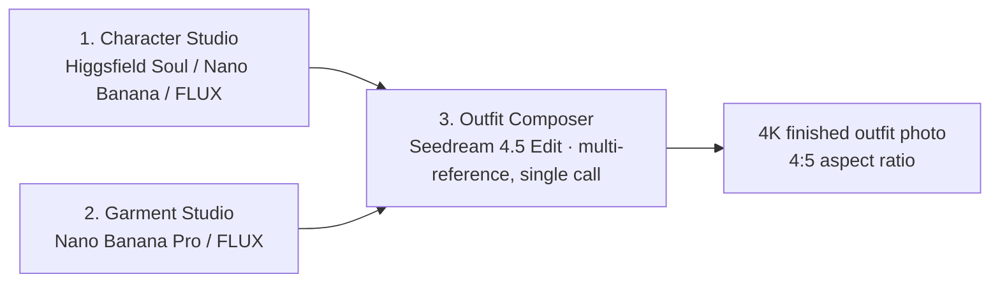

<div align="center">

# Drape

**AI fashion photos at batch scale — generate a hyperreal model, generate garments, compose multi-garment outfits in one API call.**

[](https://opensource.org/licenses/MIT)
[](https://nextjs.org)
[](https://www.typescriptlang.org)
[](https://tailwindcss.com)
[](https://supabase.com)

From SKU list to e-commerce-ready photos in minutes, at **~$0.06 per finished image** and **~80 seconds for 50 outfits**.

[Quickstart](#quickstart) · [Deploy to Netlify](#deploy-to-netlify) · [How it works](#how-it-works) · [Prompt engineering](#prompt-engineering) · [Roadmap](#roadmap)

</div>

---

## The problem

Every fashion brand has the same problem: every new SKU drop means a new shoot.
Model bookings, studio rentals, styling, retouching, approvals — multiplied across colorways, sizes, and channels. A 50-piece collection routinely costs **\$5,000–\$15,000** in production and burns **2–3 weeks** before the first PDP image goes live.

The brief that started this project :

> _"We need a workflow that takes a batch of outfits and returns batch of finished images — same model, same backdrop, same lighting, with multi-garment composition (jacket + shirt + trousers in one image) as the hardest part. Cost per image under \$0.50, batch of 50 in under an hour, no manual intervention between outfits."_

What that brand had already tried:

| Approach | What broke |
|---|---|
| Magnific Spaces (manual UI) | Per-image is good. **API is unusable** for batching. |
| `Kling Try-On → Nano Banana edit → Topaz upscale` (chain on fal.ai) | **~33% commercially usable** per their internal review. Identity drifts, colours shift, garments smear by image 10. Every link in the chain accumulates error. |
| Train a brand LoRA + ComfyUI | Works for one model. Multi-garment composition still brittle. Hours of pipeline-babysitting per drop. |

The core failure: **multi-garment composition on a consistent character** is genuinely hard, and the standard chain-everything approach loses identity, colour fidelity, or fabric drape at every step.

---

## Why a 3-stage pipeline beats chains

Most AI try-on pipelines look like this:

```
character ref → virtual try-on (single garment) → another try-on → another → upscale → finished
```

Each `→` is a place where identity drifts, a colour shifts, or a hem gets hallucinated. By outfit 20, your "model" looks like a different person.

**Drape collapses the multi-garment step into a single multi-reference call.** The character is reference image #1, the garments are reference images #2–N, and Seedream 4.5 Edit composes them in one pass with the prompt locking identity, colour, and layering explicitly. No chain. No drift.



**Stage 1 — Character Studio.** Generate one hyperreal model. Save it once.
**Stage 2 — Garment Studio.** Generate (or upload) studio packshots. Categorised, reusable, stored in Supabase.
**Stage 3 — Outfit Composer.** Pick a character + 2–5 garments → one Seedream call → finished editorial photo. Identity stays pixel-stable because the character is locked as reference image #1.

No LoRA training. No fine-tuning. Brand-new model identity in 30 seconds, used across the entire batch.

---

## What it produces

| Metric | Drape | Traditional shoot | Existing `Kling+Nano Banana` chain |
|---|---|---|---|
| **Cost per finished image** | **\$0.06** | \$50–200 | \$0.30 |
| **Wall clock — 50 outfits** | **~80s** (5× parallel) | 2–3 days | ~25 min |
| **Identity consistency** | **Pixel-stable** (ref-locked) | Same model = consistent | Drifts after ~10 outfits |
| **Multi-garment composition** | **Single shot**, no error stack | Native | Brittle chain |
| **Output quality** | **80–90% commercial-grade** out of the box | 100% | ~33% per client review |
| **Setup time** | Open repo + 3 API keys | Weeks | Days of pipeline tuning |

Cost breakdown for a 50-outfit batch:

- **Character:** generated once → \$0.07 amortised → effectively \$0
- **Garments:** ~12 unique pieces × \$0.04 = \$0.48 amortised across outfits
- **Composition:** 50 × \$0.06 = **\$3.00**
- **Total batch:** ~\$3.50 → **\$0.07 per outfit**, well under the \$0.50 brief target.

---

## How it works

### Stage 1 — Character Studio (`/character`)

You describe a model in plain English (age, build, hair, ethnicity, expression). Drape calls one of:

- **Higgsfield Soul** ([higgsfield.ai](https://higgsfield.ai)) — primary. Hyperreal, magazine-quality, the strongest at faces and skin texture in our testing.
- **Nano Banana Pro** (fal.ai) — fast, cheap fallback.
- **FLUX 1.1 / 2 Pro** (fal.ai) — alternative aesthetic.

The selected style preset (`editorial / streetwear / minimalist / luxury`) injects lighting and styling vocabulary into the prompt automatically. The result is saved to Supabase as the **identity reference** that anchors every outfit downstream.

### Stage 2 — Garment Studio (`/garments`)

Generate clean studio packshots for tops, bottoms, outerwear, dresses, bags, shoes, and accessories — each category injects its own prompt fragment so a "camel coat" comes out as a flat product photo, not a fashion editorial. Or skip generation entirely and **upload real product photos** via the same UI; they land in the same Supabase library with the same category tagging.

The library is filterable, deletable, and persistent — build it once, reuse across every collection.

### Stage 3 — Outfit Composer (`/composer`)

Pick a saved character + 1–8 garments. Drape:

1. Resolves all asset URLs from Supabase.
2. Builds a structured prompt referencing every input as `Image 1, Image 2, …` with explicit content descriptions (`Image 2 shows the outerwear (camel coat); Image 3 shows the bottom (navy trousers); …`).
3. Sends a single `fal-ai/bytedance/seedream/v4.5/edit` call with all reference images at 1024×1280 (4:5 — fashion e-commerce standard).
4. Saves the result back to Supabase Storage, mirroring the image off the fal CDN so it's yours.

No virtual try-on chains. No upscaling step. No identity drift.

---

## Prompt engineering

This is where most AI try-on pipelines fail and where Drape spent the most effort. The default composition prompt is generated programmatically from the selected garments and applies nine principles derived from Seedream 4.5's training characteristics:

1. **Natural prose, not key=value soup.** Seedream is trained on captions, not tags. We write a paragraph a stylist would write to a photographer.
2. **Explicit `Image N` references with content.** Every reference image is named *and* described: `"Image 2 shows the outerwear (camel coat); use it for the model's coat"`. This dramatically reduces "which garment goes where" confusion.
3. **Dynamic pose derivation from the garment mix.** A dress + heels gets a different pose than streetwear + sneakers — the prompt inserts a context-aware editorial pose so the result isn't a stiff mannequin shot.
4. **Layering instructions.** Outerwear goes *over* the top. Bags hang from the shoulder, not float beside it. Shoes are visible. The prompt spells out the layering order so the model doesn't have to guess.
5. **Fashion photography vocabulary.** `85mm portrait lens look`, `soft diffused front lighting`, `shallow depth of field`, `editorial composition` — terminology that pulls the model toward the right manifold.
6. **Explicit anti-contamination.** `Do NOT use the white product backgrounds from the garment images.` This single line eliminates the most common artifact: a studio backdrop leaking from one of the packshot inputs into the final composition.
7. **Identity lock.** `Do not alter the model's face, identity, or body shape from Image 1.` Hard, simple, effective.
8. **Colour and fabric lock.** `Do not modify any garment's colour, pattern, material, or hardware.` The prompt names each garment so changes are spec-violating, not creative.
9. **4:5 aspect ratio (1024×1280).** Matches every e-commerce PDP in the industry — no awkward cropping on Shopify, Centra, or any social channel.

Every Drape composition shows you the **exact prompt that was sent** under "Show prompt used" — auditable, tweakable, copy-paste-able.

The full prompt-building logic lives in [`src/lib/fal.ts → buildCompositionPrompt`](src/lib/fal.ts). It's ~150 lines, fully commented, and the single most leverage-y file in the codebase. Tune it, fork it, send a PR.

---

## Tech stack

- **[Next.js 16](https://nextjs.org)** (App Router + Server Actions) — frontend, server-side API routes, hot reload
- **[TypeScript 5](https://www.typescriptlang.org)** — typed end-to-end
- **[Tailwind CSS 4](https://tailwindcss.com)** + **[Lucide](https://lucide.dev)** icons
- **[Supabase](https://supabase.com)** — Postgres for the asset/outfit tables, Storage for image files, RLS-ready for multi-tenant
- **[fal.ai](https://fal.ai)** — Seedream 4.5 Edit (composition), Nano Banana Pro, FLUX 1.1/2 Pro (character + garments)
- **[Higgsfield Soul](https://higgsfield.ai)** — hyperreal character generation (primary)
- **[Netlify](https://netlify.com)** — hosting via `@netlify/plugin-nextjs`
- **[`zod`](https://github.com/colinhacks/zod)** for request validation, **[`p-limit`](https://github.com/sindresorhus/p-limit)** for batch concurrency control

---

## Quickstart

### Prerequisites

- Node.js **20+**
- A free [Supabase](https://supabase.com) project (Postgres + Storage)
- A [fal.ai](https://fal.ai/dashboard/keys) API key
- _(Optional but recommended)_ [Higgsfield](https://platform.higgsfield.ai) API key + secret

### 1. Clone & install

```bash
git clone https://github.com/your-org/drape.git
cd drape
npm install
```

### 2. Configure environment variables

Copy the example file and fill in the values:

```bash
cp .env.example .env.local
```

Minimum to run locally:

| Variable | Required for | Where to get it |
|---|---|---|
| `FAL_KEY` | Garment generation + outfit composition | [fal.ai/dashboard/keys](https://fal.ai/dashboard/keys) |
| `HIGGSFIELD_API_KEY` + `HIGGSFIELD_API_SECRET` | Hyperreal character generation _(recommended)_ | [platform.higgsfield.ai](https://platform.higgsfield.ai) |
| `NEXT_PUBLIC_SUPABASE_URL` | Asset library + outfit history | Supabase dashboard → Settings → API |
| `NEXT_PUBLIC_SUPABASE_ANON_KEY` | Browser → Supabase reads | Supabase dashboard → Settings → API |
| `SUPABASE_SERVICE_ROLE_KEY` | Server writes that bypass RLS | Supabase dashboard → Settings → API |

If Higgsfield keys are absent, the Character Studio falls back to fal.ai's Nano Banana / FLUX models automatically.

### 3. Set up Supabase

1. Create a new Supabase project (free tier is fine for the demo).
2. Open the SQL Editor in your project dashboard.
3. Paste and run the contents of [`supabase/migrations/0001_initial.sql`](supabase/migrations/0001_initial.sql).
   This creates the `assets`, `batches`, and `outfits` tables, plus a public `generated-assets` storage bucket with sane RLS policies.

No Supabase CLI or local linking required.

### 4. Run

```bash
npm run dev
```

Open [http://localhost:3000](http://localhost:3000). The home page shows live status pills for each API — green means you're wired up.

---

## Deploy to Netlify

The repo already includes [`netlify.toml`](netlify.toml) with the `@netlify/plugin-nextjs` adapter, so a deploy is essentially:

### Option A — One-click

1. Push this repo to your own GitHub account.
2. Go to [app.netlify.com](https://app.netlify.com/start) → **Import an existing project** → pick your fork.
3. Netlify auto-detects Next.js. Confirm `npm run build` as the build command.
4. In **Site settings → Environment variables**, add every variable from `.env.example`:
   - `FAL_KEY`
   - `HIGGSFIELD_API_KEY`, `HIGGSFIELD_API_SECRET`
   - `NEXT_PUBLIC_SUPABASE_URL`, `NEXT_PUBLIC_SUPABASE_ANON_KEY`, `SUPABASE_SERVICE_ROLE_KEY`
5. Deploy. First build typically completes in ~90s.

### Option B — CLI

```bash
npm install -g netlify-cli
netlify login
netlify init    # link to a new site
netlify env:import .env.local    # imports your local env to Netlify
netlify deploy --build --prod
```

That's it — production URL in under two minutes.

> **Note on image domains.** Drape mirrors all generated images from fal/Higgsfield CDNs into Supabase Storage on save, so production images live on _your_ Supabase project (cheap, durable, yours). The transient preview images use `` directly so Next.js image-optimisation domains don't need to be whitelisted.

---

## How this helps people

Drape is released MIT for three reasons:

1. **Small fashion brands are priced out of AI tooling.** Magnific Spaces is \$39+/month per seat. The big "AI fashion photo" SaaS products are \$200–\$2000/month. A solo designer or a 3-person DTC brand can run Drape on Netlify's free tier + a few dollars of API credits and get the same output.
2. **The interesting work is the prompt engineering, not the plumbing.** Every fashion-AI startup is rebuilding the same Next.js + Supabase + fal/Higgsfield wiring. Open-sourcing the boring parts lets people build _better_ AI fashion tools on top.
3. **The composition prompt is genuinely novel and benefits from public iteration.** The 9 principles in [`buildCompositionPrompt`](src/lib/fal.ts) are working hypotheses from real testing. Forking, testing on your own garment library, and sending back PRs makes the prompt better for everyone.

If you ship a fashion brand using Drape, or fork it for something tangentially related (sneaker drops, accessory packshots, jewellery on models, costume design previews), we'd love to hear about it — open an issue with a screenshot.

---

## Roadmap

- [x] **Stage 1** — Character Studio (Higgsfield Soul + fal.ai Nano Banana / FLUX)
- [x] **Stage 2** — Garment Studio (generate + upload + categorised library)
- [x] **Stage 3** — Outfit Composer (single-outfit Seedream 4.5 Edit)
- [ ] **Batch runner** — queue 50+ outfits from a CSV/JSON, watch them populate live with progress bars
- [ ] **Google Drive / S3 / Shopify delivery** — auto-deliver approved outfits to your CMS
- [ ] **Approval workflow** — accept / regenerate / reject per outfit
- [ ] **Brand LoRA upload** — supply your trained model identity instead of generating one
- [ ] **Multi-character batches** — A/B test two model identities against the same garment set
- [ ] **Pose library** — pre-baked poses (front, three-quarter, walking, seated) selectable per outfit

PRs welcome on any of the above.

---

## Project structure

```
src/
  app/
    page.tsx                  # marketing home
    character/page.tsx        # Stage 1
    garments/page.tsx         # Stage 2
    composer/page.tsx         # Stage 3
    api/
      character/{generate,save}/route.ts
      garment/{generate,save,upload}/route.ts
      outfit/{generate,save}/route.ts
      outfits/{list,[id]}/route.ts
      assets/{list,[id]}/route.ts
  components/
    app-shell.tsx             # nav + footer
    character-studio.tsx
    garment-studio.tsx
    outfit-composer.tsx       # the big one
  lib/
    env.ts                    # type-safe env access
    fal.ts                    # fal.ai client + composition prompt builder
    higgsfield.ts             # Higgsfield API (submit-and-poll)
    character.ts              # unified character dispatcher
    garment.ts                # garment generation orchestration
    assets.ts                 # Supabase asset CRUD
    outfits.ts                # Supabase outfit CRUD
    supabase.ts               # client factories
supabase/
  migrations/0001_initial.sql # one-shot schema
netlify.toml                  # Netlify build config
```

---

## Contributing

This is an open repo. The fastest way to be useful:

- **Improve the composition prompt** in `src/lib/fal.ts`. Test on your own garment set, share before/after screenshots in an issue.
- **Add a new model provider.** The character dispatcher in `src/lib/character.ts` and the model registries in `src/lib/fal.ts` make it ~50 lines to wire in another image API.
- **Build the batch runner.** It's the next big roadmap item — the schema (`batches` table) is already there.

Run `npm run lint` before pushing.

---

## License

[MIT](LICENSE) — do whatever you want, no warranty.

---

## Acknowledgements

Built on the shoulders of:

- The [fal.ai](https://fal.ai) team for shipping Seedream 4.5 Edit as an API with multi-reference support.
- [Higgsfield](https://higgsfield.ai) for the Soul model — the best hyperreal character generator we've found at any price.
- [Supabase](https://supabase.com) for making Postgres + Storage + Auth trivial.
- The Upwork brand whose RFP started this project — you know who you are.

If Drape ends up useful to you, a GitHub star is the simplest way to say thanks.
